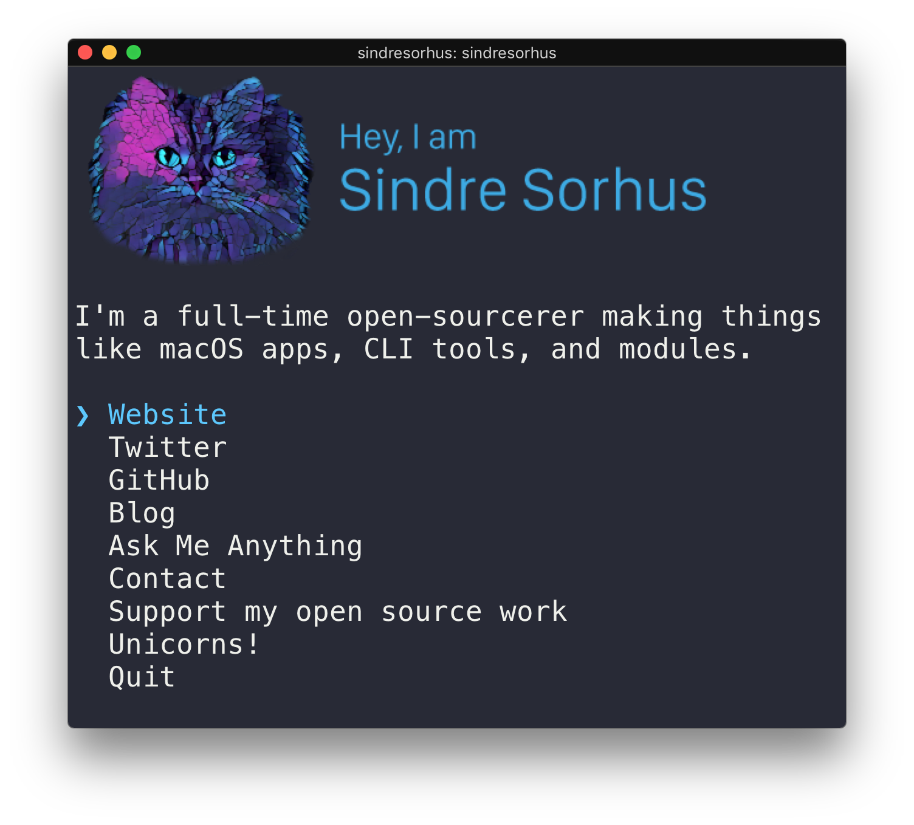

# goryudyuma
[](https://travis-ci.org/Goryudyuma/Goryudyuma)

> The [Sindre Sorhus](https://063.jp) CLI

<!--

-->

## Usage

Install Node.js, then:

```
$ npx goryudyuma
```


## Built with

- [ink](https://github.com/vadimdemedes/ink) - React for interactive command-line apps
- [terminal-image](https://github.com/sindresorhus/terminal-image) - Display images in the terminal


## License

MIT © [Sindre Sorhus](https://sindresorhus.com)
